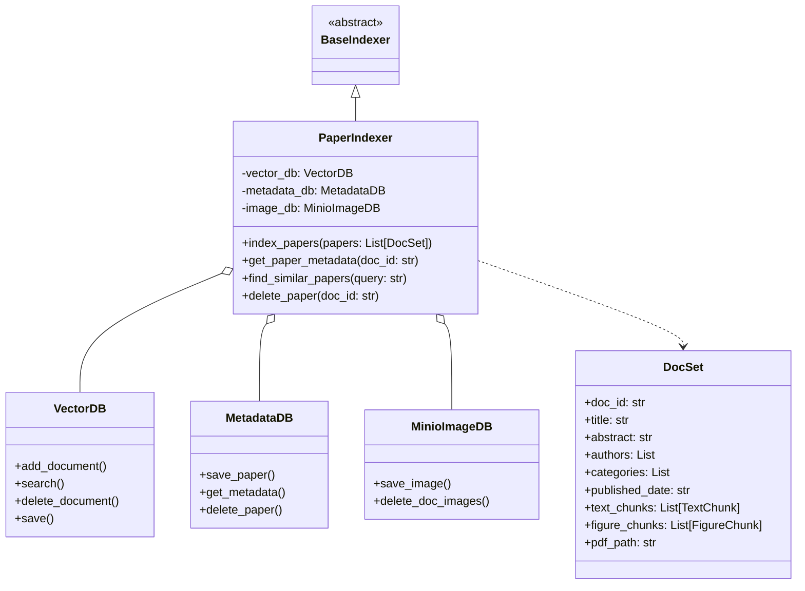
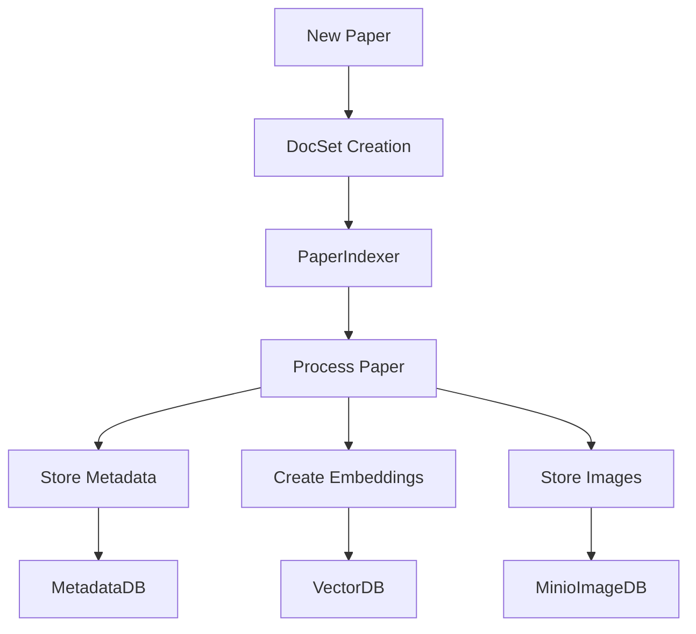

# AIgnite Documentation

## System Architecture

### Class Relationships


## Components Overview

### 1. Document Management
#### DocSet
- **Purpose**: Represents a complete academic paper with all its components
- **Key Components**:
  - Document metadata (title, authors, etc.)
  - Text content (chunked for processing)
  - Figures and images
  - PDF source file

### 2. Database Layer
#### VectorDB
- **Purpose**: Manages text embeddings for semantic search
- **Key Functions**:
  ```python
  - add_document(doc_id, abstract, text_chunks, metadata)
  - search(query, k=5)
  - delete_document(doc_id)
  - save()
  ```

#### MetadataDB
- **Purpose**: Stores paper metadata and relationships
- **Key Functions**:
  ```python
  - save_paper(doc_id, pdf_path, metadata)
  - get_metadata(doc_id)
  - delete_paper(doc_id)
  ```

#### MinioImageDB
- **Purpose**: Manages storage of paper figures and images
- **Key Functions**:
  ```python
  - save_image(doc_id, image_id, image_path)
  - delete_doc_images(doc_id)
  ```

### 3. Indexing Layer
#### PaperIndexer
- **Purpose**: Coordinates between different databases and manages paper processing
- **Key Functions**:
  ```python
  - index_papers(papers: List[DocSet])
  - get_paper_metadata(doc_id: str)
  - find_similar_papers(query: str)
  - delete_paper(doc_id: str)
  ```

## Data Flow



## Usage Examples

### 1. Indexing a New Paper
```python
# Create DocSet instance
paper = DocSet(
    doc_id="paper123",
    title="Example Paper",
    abstract="...",
    authors=["Author1", "Author2"],
    pdf_path="/path/to/pdf"
)

# Index the paper
indexer.index_papers([paper])
```

### 2. Searching Papers
```python
# Search for similar papers
results = indexer.find_similar_papers(
    query="quantum computing",
    top_k=5,
    similarity_cutoff=0.7
)
```

### 3. Managing Paper Data
```python
# Get paper metadata
metadata = indexer.get_paper_metadata("paper123")

# Delete a paper
success = indexer.delete_paper("paper123")
```

## Implementation Notes

### Database Coordination
- The PaperIndexer ensures atomic operations across all databases
- Rollback mechanisms are implemented for failed operations
- Each database operation is logged for debugging

### Error Handling
- Comprehensive error handling at each layer
- Logging of all operations
- Cleanup procedures for failed operations

### Performance Considerations
- Batch processing of papers
- Efficient vector storage and retrieval
- Optimized image handling